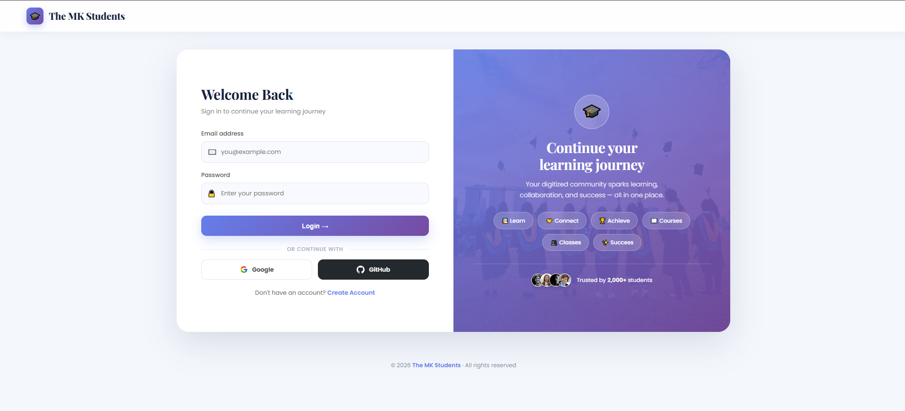
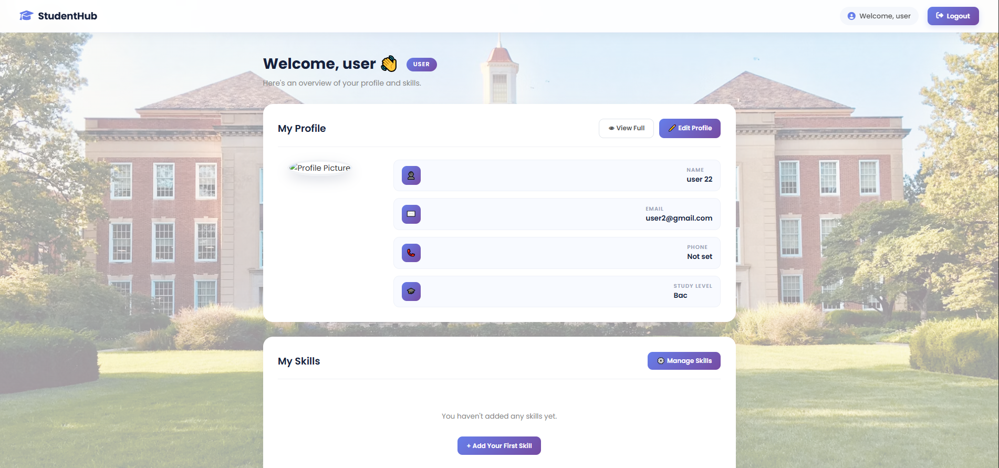
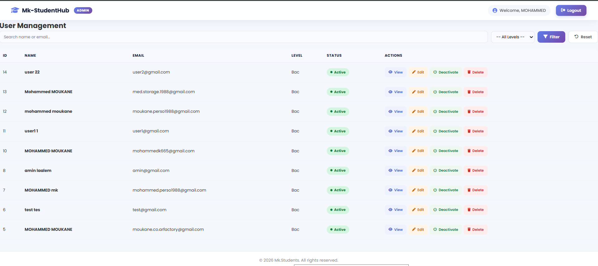

# 🎓 The MK Students

A modern student platform built with **PHP + MySQL**, featuring email/password auth, social login via **Google** and **GitHub**, and role-based dashboards for both students and administrators.


---

## ✨ Features

### 🔐 Authentication
- Email + password registration & login
- **Google OAuth 2.0** login
- **GitHub OAuth 2.0** login
- Secure sessions, hashed passwords (`password_hash`)

### 👥 Role-based Dashboards
- **User dashboard** — profile, skills, edit info
- **Admin dashboard** — manage all users

### 🛠️ Admin Panel
- Search users by name or email
- Filter by study level
- View / Edit / Activate / Deactivate / Delete users
- Status badges (Active / Inactive)

### 👤 User Profile
- Bio, phone, study level
- Skills tags
- Profile picture upload
- Full profile view

### 🎨 UI/UX
- Modern university-themed design
- Responsive (mobile + desktop)
- Smooth animations
- Clean typography (Playfair Display + Poppins)

---

## 🚀 Tech Stack

| Layer | Technology |
|-------|------------|
| **Backend** | PHP 8+ |
| **Database** | MySQL (MariaDB) |
| **Auth** | Sessions + OAuth 2.0 (Google, GitHub) |
| **Frontend** | HTML5, CSS3, Vanilla JS |
| **Server** | Apache (XAMPP) |
| **Fonts/Icons** | Google Fonts, Font Awesome |

---

## 📦 Setup Instructions

### 1. Clone the repository

```bash
git clone https://github.com/moukanecoarfactory-design/mk-students.git
cd mk-students
```

### 2. Move to XAMPP

Place the folder inside:

```
C:\xampp\htdocs\mk-students\
```

### 3. Create the database

Open phpMyAdmin → create a database named:

```
mk-students
```

Then import the SQL schema (if `database.sql` is provided) or run the setup queries manually.

### 4. Configure your credentials

Copy the example config files:

```bash
cp config/database.example.php config/database.php
cp config/google.example.php   config/google.php
cp config/github.example.php   config/github.php
```

Then open each new file and fill in **your own values** (database name, OAuth Client ID + Secret).

### 5. Set up Google OAuth

1. Go to [Google Cloud Console](https://console.cloud.google.com/apis/credentials)
2. Create OAuth 2.0 Client ID → **Web application**
3. Authorized redirect URI:
   ```
   http://localhost/mk-students/google-callback.php
   ```

### 6. Set up GitHub OAuth

1. Go to [GitHub Developer Settings](https://github.com/settings/developers)
2. New OAuth App
3. Authorization callback URL:
   ```
   http://localhost/mk-students/github-callback.php
   ```

### 7. Start XAMPP

Run **Apache** + **MySQL**, then visit:

```
http://localhost/mk-students/
```

---

## 📁 Project Structure

```
mk-students/
├── admin/                  # Admin dashboard + user management
│   ├── dashboard.php
│   ├── view-user.php
│   ├── edit-user.php
│   ├── toggle-user.php
│   └── delete-user.php
├── user/                   # User dashboard + profile
│   ├── dashboard.php
│   ├── profile.php
│   ├── edit-profile.php
│   ├── skills.php
│   └── delete-account.php
├── config/                 # Database + OAuth configs
│   ├── database.example.php
│   ├── google.example.php
│   └── github.example.php
├── css/style.css
├── js/script.js
├── includes/
│   ├── header.php
│   ├── footer.php
│   ├── auth.php
│   └── functions.php
├── uploads/profiles/       # Profile pictures
├── index.php               # Login + Register page
├── login.php
├── register.php
├── logout.php
├── google-login.php
├── google-callback.php
├── github-login.php
└── github-callback.php
```

---

## 🔒 Security

- ✅ Passwords hashed with `password_hash()` (bcrypt)
- ✅ All SQL queries use **prepared statements** (no SQL injection)
- ✅ OAuth secrets protected via **`.gitignore`**
- ✅ CSRF state tokens used in OAuth flows
- ✅ Session-based authentication

---

## 📸 Screenshots

### 🔐 Login / Register Page



### 👤 User Dashboard



### 🛠️ Admin Dashboard


---

## 📄 License

This project is licensed under the **MIT License** — free to use for learning and personal projects.

---

## 👨‍💻 Author

**Mohammed Moukane**
- GitHub: [@moukanecoarfactory-design](https://github.com/moukanecoarfactory-design)

---

⭐ If you found this project useful, consider giving it a star!
